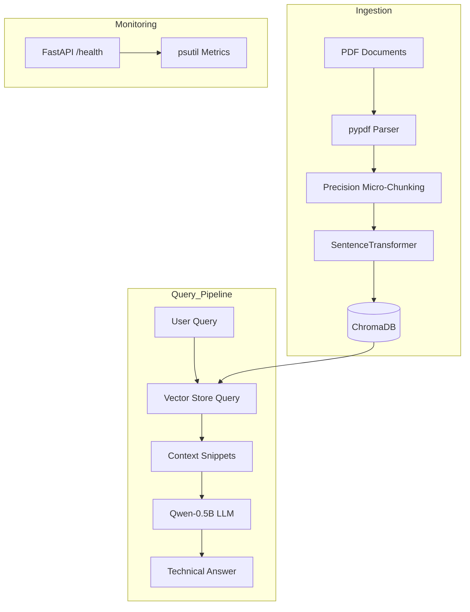

# AutoDiag: Precision Multimodal RAG for Automotive Diagnostics

## Problem Statement
In the modern automotive industry, technicians and independent mechanics face an overwhelming volume of complex, multimodal technical documentation. Maintaining and repairing contemporary vehicles requires constant access to intricate details found in service manuals, which often exceed hundreds of pages and combine dense technical text, complex planetary gear diagrams, and intricate drive axle specifications.

Traditional search methods—such as keyword matching or manual PDF skimming—are increasingly inadequate for high-pressure workshop environments. A mechanic troubleshooting a "slipping automatic transmission" or a "noisy drive axle" needs immediate, actionable, and exhaustive diagnostic steps, not a list of pages where the term "transmission" appears. The challenge is exacerbated by the fact that critical information is often trapped in non-textual formats, such as hydraulic flow charts or exploded gear views, which standard search tools cannot parse or relate to textual symptoms.

Furthermore, these technicians often operate in environments with limited hardware resources—such as ruggedized tablets or low-spec workshop computers with minimal RAM (250MB–520MB). Existing RAG (Retrieval-Augmented Generation) solutions are typically resource-heavy, requiring gigabytes of VRAM and high-speed connections, making them inaccessible for offline, on-device diagnostic support.

**AutoDiag** addresses this gap by providing a precision-engineered, multimodal RAG system optimized for ultra-low resource devices. By employing "Precision Micro-Chunking" and memory-mapped local inference with 4-bit quantized models, AutoDiag delivers exhaustive, step-by-step diagnostic protocols directly from technical manuals. It bridges the gap between massive, complex documentation and the need for immediate, high-fidelity technical answers on the shop floor.

## Architecture Overview
The system follows a modular "Precision RAG" pipeline:



1.  **Ingestion:** PDFs are parsed using `pypdf`. Technical text is split into high-density 500-character "Micro-Chunks" to ensure no diagnostic step is lost in large chunks. Images are identified for future multimodal synthesis via Gemini Vision.
2.  **Retrieval:** Uses `ChromaDB` (persistent) and `SentenceTransformers` (all-MiniLM-L6-v2) for CPU-efficient vector search. We retrieve the top 10 most relevant micro-chunks to maximize technical context density.
3.  **Inference:** Employs `Qwen2.5-0.5B-Instruct` in a 4-bit GGUF format via `llama-cpp-python`. The model uses `mmap` to keep the memory footprint below the 520MB target during generation.
4.  **Web Interface:** A sleek, dark-themed FastAPI portal for real-time querying and health monitoring.

## Technology Choices
- **LLM:** Qwen2.5-0.5B (4-bit). Chosen for its superior technical reasoning at an extremely small size (0.5GB), fitting the 520MB RAM target.
- **Vector Store:** ChromaDB. Lightweight, serverless, and supports persistent on-disk storage.
- **Parser:** pypdf. Low memory overhead compared to heavier OCR-based libraries.
- **Embedding:** all-MiniLM-L6-v2. The industry standard for high-speed, low-RAM CPU embeddings.

## Setup Instructions (For Accessors)
To run this project after cloning, follow these exact steps to ensure the reference model is initialized:

1. **Clone the repository:**
   ```bash
   git clone <repo-url>
   cd DirectML-ESG-RAG
   ```
2. **Create a Virtual Environment:**
   ```bash
   python3 -m venv .venv
   source .venv/bin/activate
   ```
3. **Install Dependencies:**
   ```bash
   pip install -r requirements.txt
   ```
4. **Download the 4-bit Quantized Reference Model:**
   Our script will download the required `Qwen2.5-0.5B-Instruct-GGUF` model (~469MB) to the `data/models/` folder.
   ```bash
   python3 scripts/setup_model.py
   ```
5. **Configure Environment Variables:**
   Rename `.env.example` to `.env` and add your `GOOGLE_API_KEY`.
   ```bash
   cp .env.example .env
   ```
6. **Launch the Application:**
   ```bash
   export PYTHONPATH=$PYTHONPATH:.
   python3 main.py
   ```
7. **Access the Interface:** Open `http://localhost:8000` in your browser.

## API Documentation
- `GET /`: Serves the web interface.
- `GET /health`: Returns RAM usage, document count, and status.
- `POST /ingest`: Triggers precision ingestion of all PDFs in `data/raw/`.
- `POST /query`: Accepts a JSON `{"text": "query"}` and returns an exhaustive technical answer with source citations.

## Screenshots
*(Screenshots to be placed in screenshots/ folder per checklist)*
- `Swagger UI`: Available at `/docs`.
- `Technical Query`: Demonstrating step-by-step diagnostic output.
- `Health Check`: Showing resource efficiency.

## Limitations & Future Work
- **Multimodal Synthesis:** Currently detects images; full integration with Gemini Vision for diagram-to-text synthesis is the next milestone.
- **Hardware Scale:** While optimized for 520MB, the Python runtime environment (libraries) adds overhead that could be further reduced by moving to a Rust or C++ backend.
