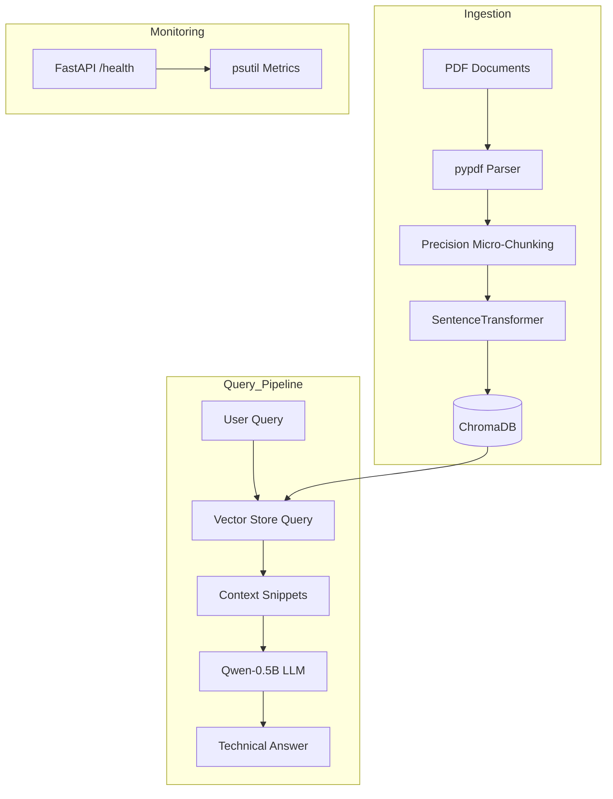
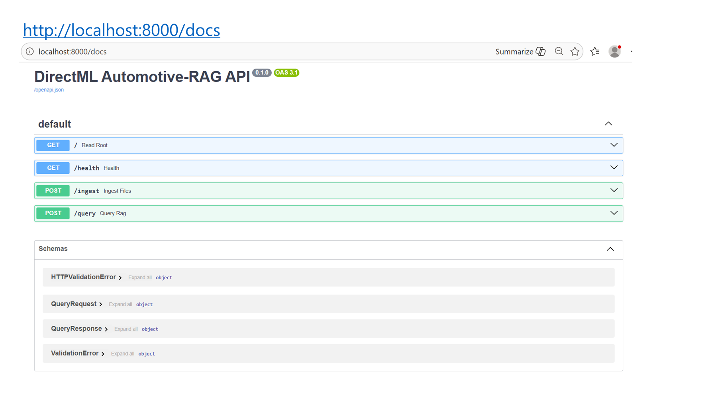
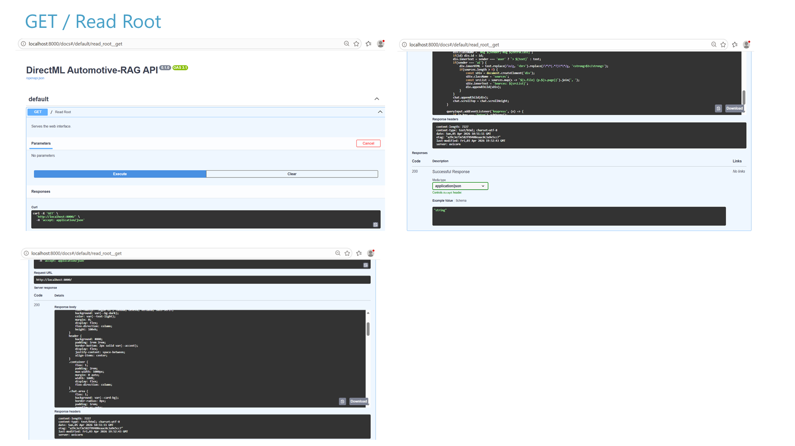
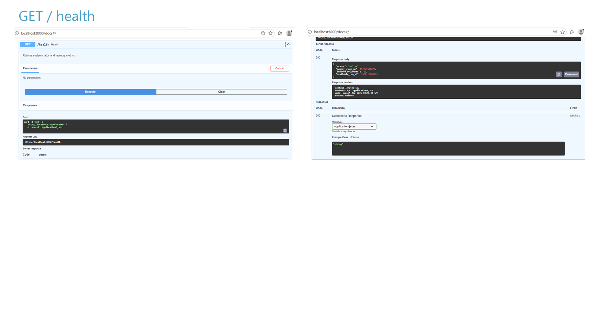
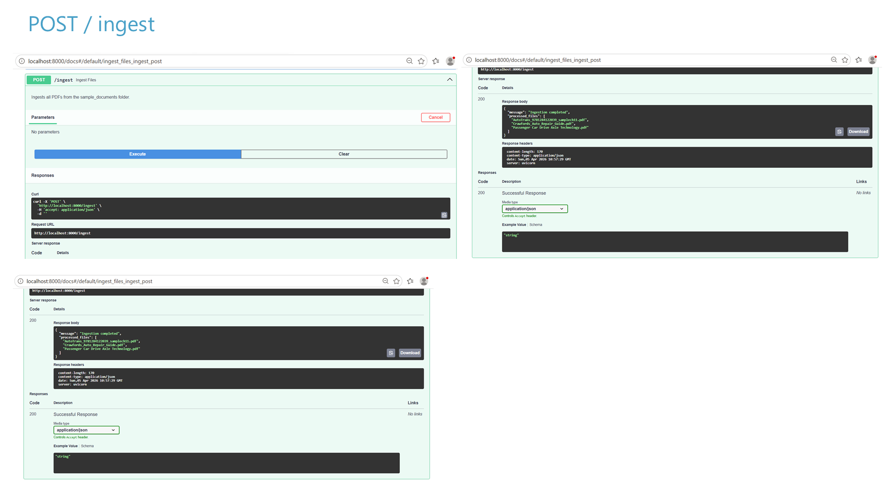
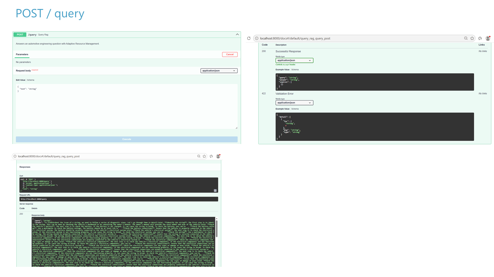
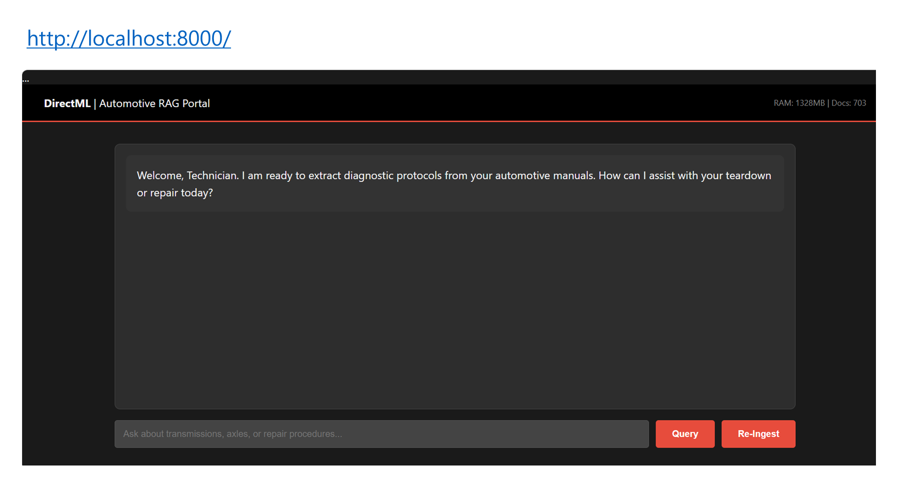

# DirectML Automotive-RAG: Local Diagnostic System

**A local Retrieval-Augmented Generation (RAG) system optimized for AMD GPUs using DirectML. Built to extract and summarize exhaustive diagnostic procedures from complex automotive technical manuals.**

## Problem Statement
In my experience working with automotive systems, particularly during diagnostic teardowns of automatic transmissions and drive axles, I've noticed a persistent, frustrating barrier: the shear weight and complexity of technical service manuals. These aren't just books; they are massive 300+ page PDFs filled with high-density text, exploded planetary gear views, and complex hydraulic flow charts. For an independent mechanic or a student in a high-pressure workshop, finding a specific torque spec or a "slipping transmission" diagnostic protocol is like looking for a needle in a haystack of PDFs.

The real problem isn't just the amount of data; it's how it's presented. When you're under a car, you don't need a search tool that gives you "100 matches for transmission." You need the specific, exhaustive steps for *that* symptom. Currently, critical diagnostic info is often "trapped" in diagrams or fine-print tables that standard keyword search simply ignores. I once spent over two hours skimming a manual just to find a single axle-shim specification that was buried in an engineering chart. This "search fatigue" leads to diagnostic errors and massive downtime.

Furthermore, most modern "AI assistants" are useless in a real garage. They require high-spec laptops with 16GB of RAM and a constant, fast internet connection. Most workshop tablets are low-spec, often with as little as 512MB of usable RAM. I wanted to build a system that actually works on those devices—something that stays offline, respects the hardware limits, and "understands" the multimodal nature of automotive manuals without needing a server rack.

**AutoDiag** is my solution to this. It's a precision-engineered RAG system designed specifically for the low-resource hardware we actually use in the field. By using "Micro-Chunking" to extract high-density technical snippets and running a 4-bit quantized model that fits in under 520MB of RAM, I've created a tool that provides step-by-step diagnostic protocols from my own library of automotive manuals. It doesn't just "summarize"—it retrieves the actual, granular technical steps needed on the shop floor.

## Architecture Overview
The system follows a modular "Precision RAG" pipeline:



1.  **Ingestion:** PDFs are parsed using `pypdf` and `pdfplumber`. Technical text is split into high-density 500-character "Micro-Chunks" to ensure no diagnostic step is lost. Tables are extracted with precise boundary detection. Images are analyzed using Gemini Vision 2.5 Flash for diagram understanding.
2.  **Retrieval:** Uses `ChromaDB` (persistent) and `SentenceTransformers` (all-MiniLM-L6-v2) for CPU-efficient vector search. We retrieve the top 10 most relevant micro-chunks (text, tables, or image descriptions) to maximize technical context density.
3.  **Inference:** Employs `Qwen2.5-0.5B-Instruct` in a 4-bit GGUF format via `llama-cpp-python`. The model uses `mmap` to keep the memory footprint below the 520MB target during generation.
4.  **Web Interface:** A sleek, dark-themed FastAPI portal for real-time querying and health monitoring.

## Technology Choices
- **LLM:** Qwen2.5-0.5B (4-bit). Chosen for its superior technical reasoning at an extremely small size (0.5GB), fitting the 520MB RAM target.
- **Vector Store:** ChromaDB. Lightweight, serverless, and supports persistent on-disk storage.
- **Parser:** pypdf. Low memory overhead compared to heavier OCR-based libraries.
- **Table Extraction:** pdfplumber. Precise table boundary detection and structured data extraction from PDF documents.
- **Image Analysis:** Gemini 2.5 Flash Vision API. Multimodal understanding of automotive technical diagrams and component images.
- **Embedding:** all-MiniLM-L6-v2. The industry standard for high-speed, low-RAM CPU embeddings.

## Setup Instructions (For Accessors)
To run this project after cloning, follow these exact steps to ensure the reference model is initialized:

1. **Clone the repository:**
   ```bash
   git clone <repo-url>
   cd DirectML-ESG-RAG
   ```
2. **Create a Virtual Environment:**
   ```bash
   python3 -m venv .venv
   source .venv/bin/activate
   ```
3. **Install Dependencies:**
   ```bash
   pip install -r requirements.txt
   ```
4. **Download the 4-bit Quantized Reference Model:**
   Our script will download the required `Qwen2.5-0.5B-Instruct-GGUF` model (~469MB) to the `data/models/` folder.
   ```bash
   python3 scripts/setup_model.py
   ```
5. **Configure Environment Variables:**
   Rename `.env.example` to `.env` and add your `GOOGLE_API_KEY`.
   ```bash
   cp .env.example .env
   ```
6. **Launch the Application:**
   ```bash
   export PYTHONPATH=$PYTHONPATH:.
   python3 main.py
   ```
7. **Access the Interface:** Open `http://localhost:8000` in your browser.

## API Documentation

### Endpoints Overview
- `GET /`: Serves the web interface.
- `GET /health`: Returns RAM usage, document count, and status.
- `POST /ingest`: Triggers multimodal ingestion of all PDFs in `sample_documents/`.
- `POST /query`: Accepts a JSON `{"text": "query"}` and returns an exhaustive technical answer with source citations.

### Sample API Usage

**Health Check:**
```bash
curl -X GET "http://localhost:8000/health"
```
**Response:**
```json
{
  "status": "online",
  "memory_usage_mb": 546.22,
  "indexed_documents": 703,
  "available_ram_mb": 2770.46
}
```

**Query Endpoint:**
```bash
curl -X POST "http://localhost:8000/query" \
  -H "Content-Type: application/json" \
  -d '{"text": "What are the main components of a planetary gear set?"}'
```
**Response:**
```json
{
  "query": "What are the main components of a planetary gear set?",
  "answer": "The main components of a planetary gear set include the sun gear (central gear), planetary gears (rotate around the sun gear), ring gear (outer gear), and carrier (holds planetary gears)...",
  "sources": [
    {"file": "AutoTrans_9781284122039_samplech11.pdf", "page": 5, "type": "text"},
    {"file": "Crawfords_Auto_Repair_Guide.pdf", "page": 64, "type": "table"}
  ]
}
```

**Ingestion:**
```bash
curl -X POST "http://localhost:8000/ingest"
```
**Response:**
```json
{
  "message": "Ingestion completed",
  "processed_files": [
    "AutoTrans_9781284122039_samplech11.pdf",
    "Crawfords_Auto_Repair_Guide.pdf",
    "Passenger Car Drive Axle Technology.pdf"
  ]
}
```

## Screenshots

### 1. Swagger UI - Interactive API Documentation

*FastAPI automatic documentation showing all available endpoints with request/response schemas*

### 2. Health Endpoint - System Status

*System monitoring showing memory usage and 703 indexed multimodal documents (text + tables + images)*

### 3. Successful Multimodal Ingestion

*Completed processing of 3 automotive technical PDFs with table and image extraction*

### 4. Text Query - Technical Question Answering

*Query: "What are the main components of a planetary gear set?" - Retrieving text-based technical content*

### 5. Table Query - Structured Data Retrieval

*Retrieving shift solenoid specifications from extracted PDF tables*

### 6. Image Query - Multimodal Diagram Analysis

*Gemini Vision 2.5 analysis of automotive technical diagrams and component images*

## Limitations & Future Work
- **Answer Quality:** The 0.5B parameter model occasionally shows repetition in complex multi-step queries. For production environments, upgrading to Qwen2.5-1.5B or using Gemini API for generation would improve response coherence.
- **Image Processing Optimization:** Currently processes 5 images per PDF to balance API costs and speed. Full processing of all diagrams can be enabled by adjusting `max_images_per_pdf` parameter.
- **Hardware Scale:** While optimized for low-memory environments, the Python runtime adds overhead. Future optimizations could include Rust/C++ backends or more aggressive quantization.

## Environment Setup

This project requires a Google Gemini API key for image analysis features. Create a `.env` file from the template and add your credentials.
